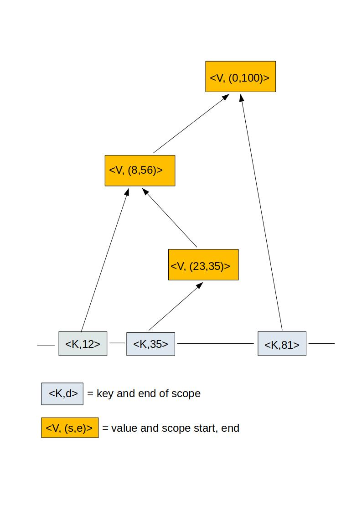

## Algorithms and Datastructures of the typedb

### Scope Bound Map

All data structures stored in the **typedb** are bound to a scope. A scope is represented as a pair of non-negative integer numbers. The first number is marking the start of the scope, meaning the first element in the scope, the second number is marking the end of the scope, meaning the first element that is not part of the scope anymore. These elements are called scope-steps. Scope and scope-steps are generated by a counter defined by operators in the grammar and are assigned as elements to the nodes of the AST generated in the process of the syntax analysis.

Every item stored in the **typedb** is stored with a scope attached to its key. On retrieval, a scope-step is part of the query and used as a filter for the results.
A search result contains only elements defined in a scope that covers the scope-step of the query.

The database is write- and read-only, there is no designated way to delete elements in the **typedb** during its lifetime (the compilation of one source unit).

#### Implementation

The scope-bound maps are derived from the original map
```K -> V```
as
```<K,E> -> ordered list of <V,(S,E)>```

E is the end of the scope of the relation K -> V.
S is the start of the scope of the relation K -> V.
The list <K,E> points to is ordered by the scope cover relation, the first element is covered by the second and so forth. 
The following image illustrates that. 



If we search in this kind of map, we do an upper bound seek for say <K,31> and we get to the key <K,35>. Then we follow the uplinks attached to it to find the elements to retrieve.s

Updates are a little bit more complicated as we have to rewire the uplinks of some predecessors and of one successor. If you are interested in the C++ code, all scope-bound data structures of the **typedb** are implemented in [src/scope.hpp](src/scope.hpp) of the Mewa project. It should probably be rewritten, as I was not in my best condition when I wrote it. But the fact that it is tested well with random tests gives some confidence that it works.

#### Shortest Path Search

The **typedb** library implements one core algorithm besides the scope-bound map lookup for type deduction: The shortest path search.
The type system is represented as a directed graph with the types as vertices and the type deduction relations (called reductions) as edges.
Each edge has a weight that implements the preference of reductions over others. In most cases the solution paths are equivalent but we want to recognize real ambiguity. For this, we implement an order of preference by attaching a weight to each reduction that picks us a unique solution from any set of equivalent paths.

Every query to resolve a symbol as a type or a query to deduce a type from another is implemented as a shortest path search.
The resulting path will be a plan for the construction of the object we were looking for. A result not found will be displayed as nil and ambiguity as a result tuple.

